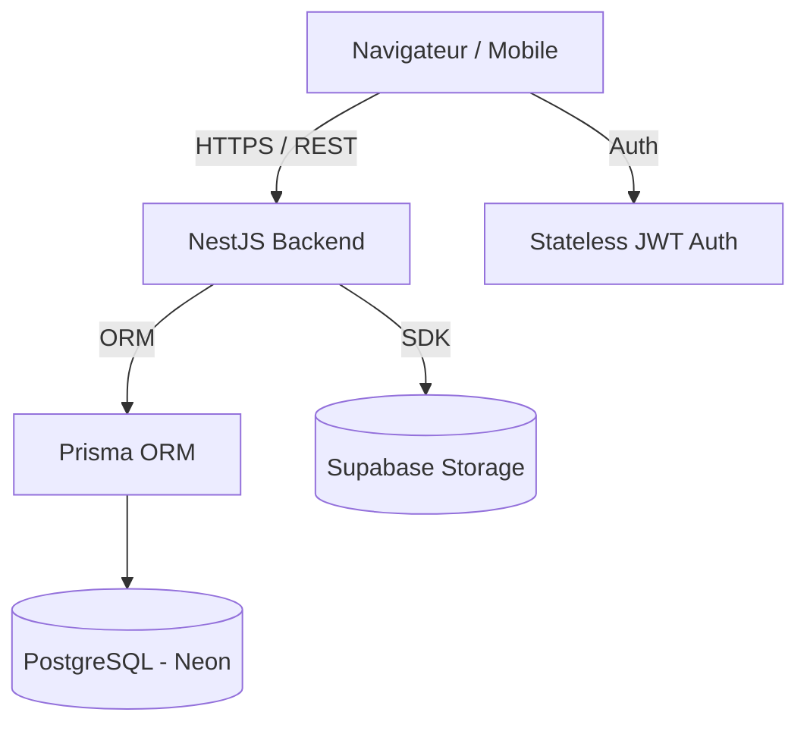

# Architecture du Projet - RideNow

Ce document décrit l'architecture globale de l'application RideNow, une plateforme premium de location de véhicules.

## 🏗️ Vue d'ensemble

RideNow repose sur une architecture moderne de type **SPA (Single Page Application)** avec un backend découplé, permettant une séparation claire des responsabilités.

### Schéma Global

## 💻 Frontend (Next.js)

Le frontend est construit avec **Next.js 14** en utilisant l'**App Router**.

- **App Router**: Gestion des routes, layouts et chargement progressif.
- **Server Components**: Optimisation du rendu et de la sécurité (ex: récupération de données côté serveur).
- **Client Components**: Pour l'interactivité riche (ex: formulaires, animations Framer Motion).
- **Context API**: Gestion globale de l'état (ex: `AuthContext` pour la session utilisateur).
- **Styles**: Utilisation hybride de **Tailwind CSS 4** pour la mise en page rapide et de **CSS Modules** pour les composants complexes.

## ⚙️ Backend (NestJS)

Le backend est structuré de manière modulaire selon les standards de **NestJS**.

- **Modules**: Organisation par domaine métier (`Auth`, `Users`, `Vehicles`, `Admin`).
- **Services**: Logique métier pure et interactions avec les bases de données.
- **Controllers**: Définition des endpoints REST et gestion des requètes/réponses.
- **Guards & Decorators**: Protection des routes basée sur les rôles (`ADMIN`, `MANAGER`, `USER`).
- **DTOs**: Validation stricte des données entrantes avec `class-validator`.

## 🗄️ Stockage des Données

- **Base de données**: PostgreSQL hébergé sur **Neon**, offrant une scalabilité serverless.
- **ORM**: **Prisma** pour un accès aux données type-safe et une gestion simplifiée des migrations.
- **Stockage de fichiers**: Buckets **Supabase** pour stocker les images des véhicules de manière sécurisée et performante.

## 🔐 Sécurité

- **Authentification**: Basée sur les JSON Web Tokens (JWT).
- **Autorisation**: Gestion fine des permissions via des guards NestJS.
- **Validation**: Validation automatique de tous les inputs via DTOs.
- **Protection**: Utilisation de CORS et de variables d'environnement pour les secrets médicaux.
